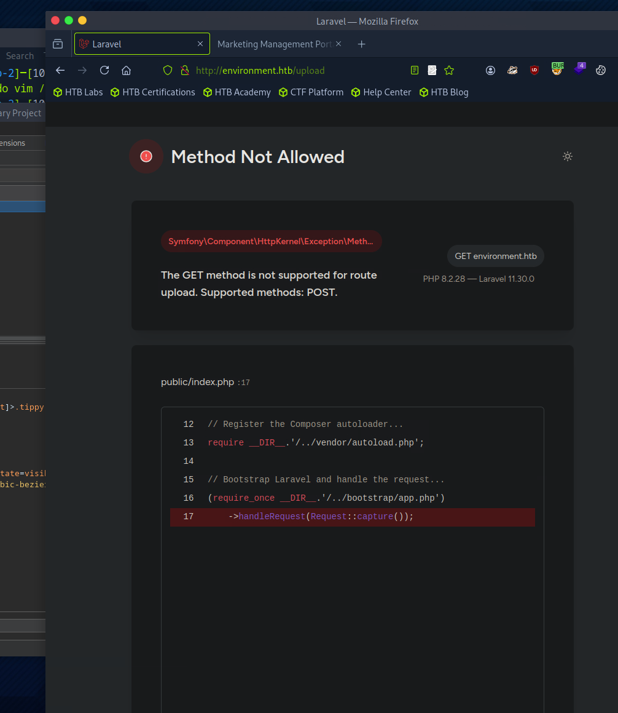

Сначало начинаем с nmap сканирования:

```bash
nmap -sV -sC -Pn -p- 10.129.108.91
Starting Nmap 7.94SVN ( https://nmap.org ) at 2025-09-04 11:00 CDT
Nmap scan report for environment.htb (10.129.108.91)
Host is up (0.075s latency).
Not shown: 65533 closed tcp ports (reset)
PORT   STATE SERVICE VERSION
22/tcp open  ssh     OpenSSH 9.2p1 Debian 2+deb12u5 (protocol 2.0)
| ssh-hostkey: 
|   256 5c:02:33:95:ef:44:e2:80:cd:3a:96:02:23:f1:92:64 (ECDSA)
|_  256 1f:3d:c2:19:55:28:a1:77:59:51:48:10:c4:4b:74:ab (ED25519)
80/tcp open  http    nginx 1.22.1
|_http-server-header: nginx/1.22.1
|_http-title: Save the Environment | environment.htb
Service Info: OS: Linux; CPE: cpe:/o:linux:linux_kernel

Service detection performed. Please report any incorrect results at https://nmap.org/submit/ .
Nmap done: 1 IP address (1 host up) scanned in 283.59 seconds
```

Стандартные порты. Посмотрим может есть какие то дериктории:

```bash
gobuster dir -u http://environment.htb/ -w /usr/share/seclists/Discovery/Web-Content/common.txt 
===============================================================
Gobuster v3.6
by OJ Reeves (@TheColonial) & Christian Mehlmauer (@firefart)
===============================================================
[+] Url:                     http://environment.htb/
[+] Method:                  GET
[+] Threads:                 10
[+] Wordlist:                /usr/share/seclists/Discovery/Web-Content/common.txt
[+] Negative Status codes:   404
[+] User Agent:              gobuster/3.6
[+] Timeout:                 10s
===============================================================
Starting gobuster in directory enumeration mode
===============================================================
/.git/HEAD            (Status: 403) [Size: 153]
/.cvs                 (Status: 403) [Size: 153]
/.config              (Status: 403) [Size: 153]
/.bashrc              (Status: 403) [Size: 153]
/.git-rewrite         (Status: 403) [Size: 153]
/.bash_history        (Status: 403) [Size: 153]
/.cache               (Status: 403) [Size: 153]
/.forward             (Status: 403) [Size: 153]
/.git/config          (Status: 403) [Size: 153]
/.git                 (Status: 403) [Size: 153]
/.cvsignore           (Status: 403) [Size: 153]
/.git/index           (Status: 403) [Size: 153]
/.git_release         (Status: 403) [Size: 153]
/.gitignore           (Status: 403) [Size: 153]
/.git/logs/           (Status: 403) [Size: 153]
/.gitattributes       (Status: 403) [Size: 153]
/.gitkeep             (Status: 403) [Size: 153]
/.gitconfig           (Status: 403) [Size: 153]
/.gitmodules          (Status: 403) [Size: 153]
/.gitk                (Status: 403) [Size: 153]
/.gitreview           (Status: 403) [Size: 153]
/.hta                 (Status: 403) [Size: 153]
/.history             (Status: 403) [Size: 153]
/.listings            (Status: 403) [Size: 153]
/.passwd              (Status: 403) [Size: 153]
/.listing             (Status: 403) [Size: 153]
/.htpasswd            (Status: 403) [Size: 153]
/.htaccess            (Status: 403) [Size: 153]
/.mysql_history       (Status: 403) [Size: 153]
/.perf                (Status: 403) [Size: 153]
/.profile             (Status: 403) [Size: 153]
/.web                 (Status: 403) [Size: 153]
/.svn/entries         (Status: 403) [Size: 153]
/.rhosts              (Status: 403) [Size: 153]
/.sh_history          (Status: 403) [Size: 153]
/.subversion          (Status: 403) [Size: 153]
/.svnignore           (Status: 403) [Size: 153]
/.ssh                 (Status: 403) [Size: 153]
/.svn                 (Status: 403) [Size: 153]
/.swf                 (Status: 403) [Size: 153]
/build                (Status: 301) [Size: 169] [--> http://environment.htb/build/]
/favicon.ico          (Status: 200) [Size: 0]
/index.php            (Status: 200) [Size: 4602]
/login                (Status: 200) [Size: 2391]
/logout               (Status: 302) [Size: 358] [--> http://environment.htb/login]
/mailing              (Status: 405) [Size: 244854]
/robots.txt           (Status: 200) [Size: 24]
/storage              (Status: 301) [Size: 169] [--> http://environment.htb/storage/]
/up                   (Status: 200) [Size: 2126]
/upload               (Status: 405) [Size: 244852]
/vendor               (Status: 301) [Size: 169] [--> http://environment.htb/vendor/]
Progress: 4723 / 4724 (99.98%)
===============================================================
Finished
===============================================================
```

Есть несколько директорий, но они нам ничего не дают.

Решил проверить другим списком и нашел это:

```bash
/login                (Status: 200) [Size: 2391]
/logout               (Status: 302) [Size: 358] [--> http://environment.htb/login]
/mailing              (Status: 405) [Size: 244854]
/robots.txt           (Status: 200) [Size: 24]
/storage              (Status: 301) [Size: 169] [--> http://environment.htb/storage/]
/up                   (Status: 200) [Size: 2126]
/upload               (Status: 405) [Size: 244852]
/vendor               (Status: 301) [Size: 169] [--> http://environment.htb/vendor/]
```

Тут меня заинтересовало /upload значит можно что то загружать на сервер.

Проверю через Burp:

Мы получили ошибку, которая говорит, что мы использовали не тот метод:



Отправляю запрос в репитер и меняю метод на POST.

